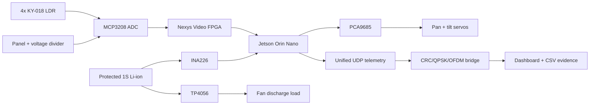

# FPGA + Jetson Orin Solar Tracker and BESS Telemetry Platform

An integrated renewable-energy prototype combining real light sensing,
two-axis solar tracking, measured battery charge/discharge telemetry,
FPGA-backed CRC/QPSK/OFDM communication profiling, and live UDP monitoring.

## System Overview



The workspace is organized as three layers of one system:

| Project | Role | Main validated result |
|---|---|---|
| `proje3` | Renewable sensing, tracking, servo control, panel and BESS telemetry | Real two-axis tracking plus measured battery charge/discharge |
| `proje1` | CRC framing and QPSK/OFDM communication profiling | Live unified 161-byte frames and Nexys Video pipeline proof |
| `proje2` | UDP transport, validation, dashboard, and logging | 368/368 valid continuous-demo packets with zero sequence gaps |

## Headline Results

| Measurement | Result |
|---|---:|
| Fixed-vs-tracking mean-power gain | `+24.141%` |
| Fixed-vs-tracking energy gain | `+24.229%` |
| Best observed tracking error | `0.012 deg` |
| Locked tracker samples in final run | `213` |
| Shading/recovery test | `120 valid, 0 gaps` |
| Real fan-load battery discharge | approximately `2.954 V`, `-231 mA`, `-0.683 W` |
| Real supervised battery charging | `+233 to +236 mA`, `+0.895 to +0.908 W` |
| Final continuous tracker+BESS run | `368/368 valid`, `0 gaps` |
| Continuous BESS state sequence | `idle -> charging -> idle -> discharging -> idle` |
| Unified communication profile | `161 B`, `644 QPSK`, `14 OFDM` |

## Hardware

- Digilent Nexys Video FPGA board
- Jetson Orin Nano Super
- MCP3208 ADC
- Four KY-018 light sensors
- PCA9685 servo controller
- Two 180-degree pan/tilt servos and replacement mechanism
- Small solar panel with a 1k-ohm measurement load
- INA226 current/power monitor with R100 shunt
- Protected 3.7 V, 2500 mAh 18650 cell
- TP4056 charger/protection module
- L9110 fan load

## Unified Data Path

```text
Nexys/MCP3208 sensor UART
  -> Orin LDR tracker + PCA9685 servo actuation + INA226 BESS measurement
  -> unified tracker/panel/BESS UDP JSON on port 5013
  -> proje1 CRC/QPSK/OFDM communication bridge
  -> forwarded UDP JSON on port 5011
  -> proje2 dashboard, validation, sequence-gap monitoring, and CSV logging
```

The final mixed communication frame contains tracker angles and target, tracking
error and state, panel voltage and estimated power, battery voltage, signed
current and power, BESS state, sequence metadata, and actuator state.

```text
Payload:       157 bytes
CRC frame:     161 bytes / 1288 bits
QPSK:          644 symbols
OFDM:          14 symbols
QPSK padding:  28 symbols
```

## Primary Evidence

- [Final bidirectional tracker+BESS demo](main_layout/demo_evidence/video/unified_tracker_bess_bidirectional_final_demo_2026-08-11.mp4)
- [Final edited unified demo](main_layout/demo_evidence/video/unified_tracker_bess_integrated_demo_2026-08-11_edited.mp4)
- [Final technical report](main_layout/demo_evidence/final_report/fpga_orin_solar_bess_final_report_2026_08_11.docx)
- [Final technical report PDF](main_layout/demo_evidence/final_report/fpga_orin_solar_bess_final_report_2026_08_11.pdf)
- [Final presentation](main_layout/demo_evidence/final_presentation/fpga_orin_solar_bess_final_presentation_2026_08_11.pptx)
- [Current system status](main_layout/current_system_status_2026_08_11.txt)
- [Authoritative hardware wiring, connectors, and BOM](main_layout/final_hardware_wiring_2026_08_11.md)
- [Reproducible setup and verification](SETUP.md)
- [Unified board-test record](proje3/docs/board_test_24_unified_tracker_bess_discharge.txt)
- [Bidirectional BESS board-test record](proje3/docs/board_test_25_unified_tracker_bess_bidirectional_demo.txt)
- [Charging board-test record](proje3/docs/board_test_23_real_bess_charge_udp_dashboard.txt)
- [Discharge board-test record](proje3/docs/board_test_22_real_bess_ina226_discharge.txt)
- [Final bidirectional bridge CSV](proje1/data/unified_tracker_bess_bidirectional_demo_bridge.csv)
- [Final bidirectional dashboard CSV](proje2/data/unified_tracker_bess_bidirectional_demo_dashboard.csv)
- [Architecture source](main_layout/demo_evidence/final_system_architecture_2026_08_11.md)
- [CV and report summary](main_layout/demo_evidence/cv_report_summary.txt)

## Repository Map

```text
main_layout/  Shared architecture, status, reports, evidence, and videos
proje1/       Digital communication simulations, HDL, bridge, and board tests
proje2/       UDP/dashboard software, reliability tests, and network evidence
proje3/       Solar/BESS sensing, Orin tracking software, HDL, and hardware tests
```

## Safety and Limitations

- The battery does not power the Orin or Nexys; both use their normal supplies.
- The TP4056 USB input is disconnected while the fan load is connected because
  simultaneous charge/load sharing has not been validated.
- Temporary battery terminals are used only for supervised bench testing.
- Indoor panel power is low because the available source is a handheld LED.
- The panel-power A/B result is estimated from voltage across a known resistor.
- The communication subsystem is CRC/QPSK/OFDM profiling and FPGA pipeline
  validation, not a complete over-the-air RF modem.

## Optional Extensions

- Outdoor sunlight measurements
- Mechanically secure battery terminals and enclosure
- Full FPGA IFFT/FFT modem or SDR/RF loopback
- Remote database or cloud deployment
