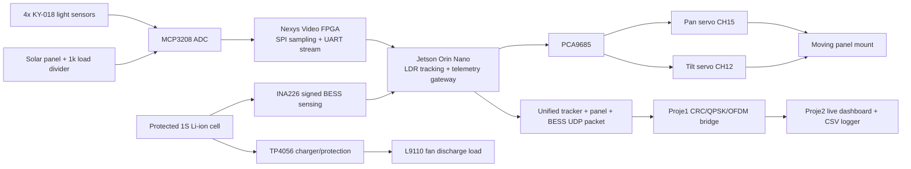

# Final Integrated System Architecture



## Ownership

```text
Proje3: sensing, tracking, servo actuation, panel/BESS telemetry, protection state
Proje1: CRC framing, QPSK/OFDM profile, FPGA communication pipeline proof
Proje2: UDP transport, validation, sequence-gap monitoring, dashboard, CSV logs
```

## Final Unified Packet Profile

```text
Payload: 157 bytes
CRC frame: 161 bytes / 1288 bits
QPSK: 644 symbols
OFDM: 14 symbols
QPSK padding: 28 symbols
```

## Continuous Final Demonstration

```text
Dashboard packets: 368/368 valid, 0 invalid, 0 sequence gaps
Bridge frames: 368/368 CRC-valid, 0 sequence gaps
BESS sequence: idle -> charging -> idle -> discharging -> idle
Tracker: 213 locked samples, 0.012-degree best observed error
```

The TP4056 USB input and fan load were used in separate supervised phases; they
were never active simultaneously. The Orin and Nexys Video remained on their
normal external supplies. The initial approximately 0.63 V INA226 bus value was
an open-path reading and is not used as battery-voltage evidence.
