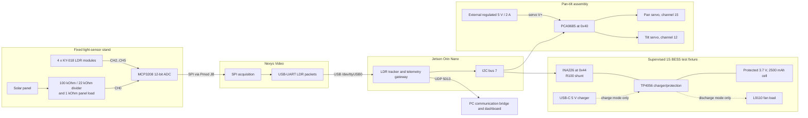

# Authoritative As-Built Hardware Wiring

**Status:** Final validated bench configuration, 2026-08-11
**Scope:** Nexys Video sensing, Jetson Orin control, two-axis servos, solar-panel measurement, and supervised 1S battery charge/discharge telemetry.

This is the single authoritative connector table and bill of materials for the demonstrated prototype. Earlier board-test notes preserve the troubleshooting history; use this document when rebuilding the final setup.

## System Schematic



## Power Domains

| Domain | Source | Connections and boundary |
|---|---|---|
| Digital logic | Orin/Nexys 3.3 V rails | MCP3208, KY-018 signal modules, PCA9685 logic, and INA226 logic use 3.3 V. Never apply 5 V to an ADC or Orin signal pin. |
| Servo power | External regulated 5 V, 2 A supply | Supply positive goes to PCA9685 `V+`; supply negative joins the common ground. `V+` is not PCA9685 logic `VCC`. |
| BESS | Protected 1S Li-ion cell through TP4056 | Electrically separate from Orin/Nexys power except for the INA226 measurement reference/common ground. It does not power either computer board. |
| Panel measurement | Small panel and passive 1 kOhm load | The panel feeds the MCP3208 divider only. It was not the TP4056 charging source in the final validation. |

All logic-side grounds used by Nexys, Orin, MCP3208, PCA9685, INA226, and the external servo supply must share a reference. Verify power is off before changing jumpers.

## Nexys Video to MCP3208

The SPI pin names below match the validated `JB` wiring and the FPGA constraints.

| MCP3208 pin | Signal | Nexys Video connection |
|---:|---|---|
| 16 | `VDD` | Pmod 3.3 V |
| 15 | `VREF` | Pmod 3.3 V |
| 14 | `AGND` | Pmod GND |
| 13 | `CLK` | `JB4`, FPGA pin `W7` |
| 12 | `DOUT` | `JB3`, FPGA pin `V7` |
| 11 | `DIN` | `JB2`, FPGA pin `V8` |
| 10 | `CS/SHDN` | `JB1`, FPGA pin `V9` |
| 9 | `DGND` | Pmod GND |

### ADC Channels

| MCP3208 channel / pin | As-built source | Notes |
|---|---|---|
| `CH0`, pin 1 | Panel-voltage divider midpoint | 100 kOhm from panel positive to CH0; 22 kOhm from CH0 to panel negative/GND. CH0 must remain below 3.3 V. |
| `CH1`, pin 2 | GND | Retained as the existing current-placeholder channel. |
| `CH2`, pin 3 | Top-left KY-018 signal | Sensor modules are stationary on the fixed cross-shaped stand. |
| `CH3`, pin 4 | Top-right KY-018 signal | Sensor label is from the sensor stand's own front-facing viewpoint. |
| `CH4`, pin 5 | Bottom-left KY-018 signal | Sensor supply is 3.3 V, not 5 V. |
| `CH5`, pin 6 | Bottom-right KY-018 signal | Verified response was approximately 0.9 V ambient to 3.3 V under the flashlight. |
| `CH6`, pin 7 | Unused | Leave open. |
| `CH7`, pin 8 | Unused | Leave open. |

Connect each KY-018 `+` pin to 3.3 V, its center `GND` pin to common GND, and its `S` pin to the channel listed above. A 1 kOhm resistor is connected directly across panel positive and panel negative for the demonstrated panel-power estimate, `P = V^2 / 1000`.

## Nexys Video to Orin

| Source | Destination | Purpose |
|---|---|---|
| Nexys Video USB-UART connector | Orin USB port | ASCII `ldr,...` sample stream; appears as `/dev/ttyUSB0` in the validated setup. |

The Nexys must be powered and programmed before starting the Orin tracker. Confirm the port each session with `ls -l /dev/ttyUSB* /dev/ttyACM* 2>/dev/null`; Linux device numbering can change after reconnecting USB.

## Orin I2C, PCA9685, and INA226

The final build uses Orin I2C bus 7 on physical header pins 3 and 5. Physical pins 27/28 map to bus 1, which is occupied by the carrier-board INA3221 at address `0x40` and was not used for the external INA226.

| Orin physical pin | Signal | PCA9685 | INA226 |
|---:|---|---|---|
| 1 | 3.3 V | `VCC` logic | `VCC` |
| 3 | I2C bus 7 SDA | `SDA` | `SDA` |
| 5 | I2C bus 7 SCL | `SCL` | `SCL` |
| 6 | GND | `GND` | `GND` |

| Device | Address | Validated configuration |
|---|---:|---|
| PCA9685 | `0x40` | Pan channel 15; tilt channel 12; nominal 500-2500 us pulse range. |
| INA226 | `0x44` | R100 = 0.1 Ohm shunt; software bus-voltage scale `0.9501`. |

Confirm both devices without disconnecting either one:

```bash
sudo i2cdetect -y -r 7
```

The expected row contains `40` and `44`; `70` may also appear as the PCA9685 all-call address.

## Servo Wiring

| Connection | Destination |
|---|---|
| External 5 V supply positive | PCA9685 servo-power terminal `V+` |
| External supply negative | PCA9685 `GND` and common system GND |
| Pan servo signal | PCA9685 channel 15 signal pin |
| Tilt servo signal | PCA9685 channel 12 signal pin |
| Both servo red/power wires | Corresponding PCA9685 channel `V+` pins |
| Both servo brown/black wires | Corresponding PCA9685 channel GND pins |

The demonstrated software range was 10-170 degrees on both axes, starting at 90 degrees. Re-check mechanical clearance whenever the bracket, horn position, or panel mounting changes.

## BESS Point-to-Point Wiring

These six connections remain in both BESS modes:

| From | To | Purpose |
|---|---|---|
| Battery-holder black | TP4056 `B-` | Cell negative |
| Battery-holder red | INA226 `VIN-` | Measured cell-positive side |
| INA226 `VIN+` | TP4056 `B+` | Routes charge/discharge current through the R100 shunt |
| INA226 `VBS` | INA226 `VIN-` | Measures cell-side bus voltage |
| TP4056 `OUT-` | INA226 GND/common GND | Protected output return and measurement reference |
| TP4056 `OUT+` | Mode-dependent load connection | Used only as described below |

### Mutually Exclusive Operating Modes

Power down before moving between modes.

| Mode | USB-C input | Fan connections | Expected INA226 sign | Validated observation |
|---|---|---|---|---|
| Idle | Disconnected | Disconnected | Near zero | Cell approximately 3.57 V. |
| Charge | Connected to a supervised 5 V USB source | **Disconnected** | Positive current/power | Red TP4056 LED; approximately +222 to +236 mA and +0.85 to +0.91 W. |
| Discharge | **Disconnected** | `OUT+ -> fan VCC and INA`; `OUT- -> fan GND and INB` | Negative current/power | Fan running; approximately -231 mA and -0.683 W in the validated run. |

Do not connect the USB-C charger and fan load simultaneously. The tested board has no validated power-path/load-sharing circuit. The MT3608 module was excluded from the final validated charge/discharge fixture.

## Bill of Materials

| Qty. | Item | Final role / relevant specification |
|---:|---|---|
| 1 | Digilent Nexys Video | FPGA SPI acquisition and UART packet source |
| 1 | NVIDIA Jetson Orin Nano Super developer kit | LDR control, I2C acquisition, and UDP telemetry |
| 1 | MCP3208 | 8-channel, 12-bit SPI ADC at 3.3 V |
| 4 | KY-018 light-sensor modules | Fixed quadrant light sensing at 3.3 V |
| 1 | Small solar panel | Independent panel-voltage/power demonstration |
| 1 each | 100 kOhm and 22 kOhm resistors | Panel-to-ADC voltage divider |
| 1 | 1 kOhm resistor | Panel measurement load |
| 1 | PCA9685 module | 16-channel servo PWM controller, I2C address `0x40` |
| 2 | 180-degree servos | Pan and tilt actuation; compatible pan-tilt bracket/horns |
| 1 | Two-axis pan-tilt mechanism | Mechanically aligned replacement assembly |
| 1 | Regulated 5 V, 2 A supply | Dedicated servo rail |
| 1 | INA226 R100 module | Signed battery current and voltage telemetry, address `0x44` |
| 1 | Protected 18650 Li-ion cell | 3.7 V nominal, 2500 mAh label rating |
| 1 | Single-cell holder | Removable protected-cell connection |
| 1 | TP4056 USB-C module | Supervised 1S charging/protection fixture |
| 1 | L9110 fan module | Demonstrated discharge load |
| 1 | USB-A to USB-C cable/source | 5 V TP4056 charge input |
| as needed | Dupont jumpers, Pmod wires, insulated tape, fixed sensor stand | Temporary supervised bench interconnects and mechanical support |

## Pre-Power Checklist

1. Confirm every module is unpowered while changing jumpers.
2. Confirm no bare battery conductor can short against another wire or tool.
3. Check polarity at the cell, TP4056, INA226, PCA9685 servo rail, and panel divider.
4. Verify the servo supply is 5 V and its negative terminal joins common GND.
5. Verify INA226 `VCC` and PCA9685 `VCC` use 3.3 V, while PCA9685 servo `V+` uses the external 5 V supply.
6. Select exactly one BESS mode: charging, discharging, or idle.
7. Measure voltage at the intended load before connecting the load.
8. Keep all battery work supervised; stop immediately for heat, swelling, odor, unstable voltage, or damaged insulation.

## Demonstrated Boundaries

- The LDR sensors were stationary beside the independently moving panel. Software maps the fixed light vector to sequential pan/tilt targets.
- The panel does not charge the battery in the validated prototype. The unified run combines tracker/panel telemetry with separately powered BESS charge/discharge telemetry.
- `bidirectional` refers to INA226 signed current observed during separate charge and discharge phases, not simultaneous bidirectional conversion.
- The temporary jumper-based battery fixture is suitable only for supervised bench evidence. A permanent build needs soldered or locking connectors, strain relief, insulation, fusing, and an enclosed battery compartment.
